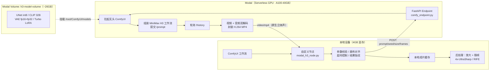

# Serverless AIGC Video Generation Platform

> 基于 **Serverless GPU（Modal）** 的 AIGC 音视频生成系统 —— 本地只有 4GB 显存，重推理跑在云端 A100，无任务时 GPU 不产生计算费用。

在本地 **ComfyUI** 里像普通节点一样出片，实际推理在云端按需拉起；输出带 **原生立体声** 的 H.264 MP4，并可通过本地后处理链路放大到 2560×1472。

---

## 1. 解决什么问题

本地显卡只有 **4GB 显存**（RTX 3050 Laptop），而 MiniMax H3 的权重约 **26GB**（UNet ~9GB int8 + Qwen3VL-32B 文本编码器 ~17GB），本地根本装不下。

但租一张常驻 GPU 又是浪费——出片是**突发型**任务，大部分时间在空转。

于是采用「**按需云端推理 + 本地工作流编排**」：

- 重推理放在 **Modal Serverless GPU**，**有请求才计费**，任务结束自动缩容；
- 本地只保留**编排、校验、后处理**，4GB 显存足够。

---

## 2. 架构



**请求时序**：本地提交参数 → 云端容器启动（冷启动时读模型）→ 无头 ComfyUI 执行工作流 → 返回 MP4 字节流 → 本地落盘并可选后处理。

---

## 3. 文件结构

```
.
├── README.md
├── requirements.txt
├── .gitignore
├── .env.example
├── modal/
│   ├── comfy_endpoint.py      # 云端端点：无头 ComfyUI + MiniMax H3 工作流 + 出片
│   └── download_models.py     # 把模型从 HuggingFace 灌进 Modal Volume
├── comfyui/
│   └── modal_h3_node.py       # 本地自定义节点：编排、校验、缓存、解码兜底
└── docs/
    ├── architecture.md        # 设计取舍与关键决策
    ├── benchmarks.md          # 实测数据与成本口径
    └── troubleshooting.md     # 踩过的坑与根因（含典型故障）
```

---

## 4. 快速开始

### 4.1 准备

```bash
pip install -r requirements.txt
modal setup          # 登录你自己的 Modal 账号
modal token new      # 生成你自己的 token
```

### 4.2 下载模型到云端 Volume（约 26GB，一次性）

在 `modal/download_models.py` 中把 `VOLUME_NAME` 改成你自己的卷名，然后：

```bash
modal run modal/download_models.py
```

> 模型从 HuggingFace 公开仓库拉取，**不依赖任何人的私有资源**。

### 4.3 部署端点（开启鉴权）

```bash
# 1) 生成一个随机 token 并创建 secret
modal secret create h3-endpoint-token H3_ENDPOINT_TOKEN=<你的随机长字符串>

# 2) 部署（把卷名改成你自己的）
#    PowerShell:
$env:H3_VOLUME_NAME="your-volume"; $env:H3_REQUIRE_AUTH="1"; modal deploy modal/comfy_endpoint.py
#    bash:
H3_VOLUME_NAME=your-volume H3_REQUIRE_AUTH=1 modal deploy modal/comfy_endpoint.py
```

部署后会打印**你自己的**地址，形如 `https://<your-workspace>--comfy-h3-serverless-generate.modal.run`。

> ⚠️ Windows 下若报 `'gbk' codec can't encode character`，先设 `$env:PYTHONUTF8="1"` 再部署。

### 4.4 本地接入 ComfyUI

```bash
cp comfyui/modal_h3_node.py <ComfyUI>/custom_nodes/
```

然后配置两个环境变量（**不要写进代码、不要提交**）：

```bash
# bash / macOS
export MODAL_H3_URL=https://<你部署输出的地址>
export MODAL_H3_TOKEN=<你在 4.3 创建的 token>

# PowerShell
$env:MODAL_H3_URL="https://<你部署输出的地址>"
$env:MODAL_H3_TOKEN="<你在 4.3 创建的 token>"
```

重启 ComfyUI，在工作流里使用 **Image to Video (MiniMax H3) 🚀** 节点即可。

> 地址填错或 token 不对会**直接报错**（401 / 连接失败），不会静默失败。
> 若你的服务端没开鉴权，可以只设 `MODAL_H3_URL`。

### 4.5 鉴权自测（离线，不产生费用）

```bash
python modal/test_auth.py     # 7 项断言，覆盖 401 与放行路径
```

### 4.6 复现检查清单

- [ ] `modal setup` 登录的是**你自己的**账号
- [ ] Volume 名改成你自己的（`h3-model-volume` 仅为占位示例）
- [ ] 模型已下载进你的 Volume（约 26GB）
- [ ] 已创建 `h3-endpoint-token` secret，并以 `H3_REQUIRE_AUTH=1` 部署
- [ ] `MODAL_H3_URL` 指向**你自己**部署输出的地址
- [ ] `MODAL_H3_TOKEN` 与 secret 里的值一致
- [ ] `python modal/test_auth.py` 全绿
- [ ] 推送前确认：仓库里**没有**任何真实端点地址（占位符是 `<your-workspace>`）

---

### 4.7 🔒 关于端点归属（重要）

**本仓库不包含任何可用的云端端点。**

| 问题 | 答案 |
|---|---|
| 仓库里有别人的端点地址吗？ | **没有**。所有地址都是占位符 `<your-workspace>--...` |
| clone 下来能直接调用作者的服务吗？ | **不能**。必须自己部署，端点属于你自己的 Modal 账号 |
| 作者部署的端点别人能用吗？ | **不能**。默认开启 Token 鉴权，无 token 请求返回 401 |
| 部署会花谁的钱？ | **花你自己的**。且无请求时容器自动缩容，不计 GPU 费用 |

这套设计是刻意的：**复现 = 各跑各的**。原作者的历史经验（实测数据、踩坑记录）随仓库公开，
但**算力资源始终各自独立**。

> 早期版本曾在本地节点里把端点地址写成了默认值——那等于把地址公开。
> 现已改为**必须由使用者通过环境变量注入**，仓库中不留任何可直连的地址。

---

## 5. 实测数据

测试条件：`1344×768 / 124 帧（约 5s @24fps）/ 8 步 Turbo`，`A100-40GB`（约 $3.29/小时）。

| 阶段 | 冷启动（前） | 冷启动（优化后） | **热容器** |
|---|---|---|---|
| 容器 + ComfyUI 启动 | 0.5–1 min | 0.5–1 min | 0 |
| 从 Volume 加载 26GB 模型 | 3–6 min | 3–6 min | **0（已在显存）** |
| 采样 | 2–3 min（20 步） | **~1 min（8 步）** | ~1 min |
| 解码 + 封装 | 0.5–1 min | 0.5–1 min | 0.5–1 min |
| **合计** | **6–11 min** | 5–8 min | **1.5–2 min** |
| **折合成本** | $0.33–0.60 | $0.28–0.44 | **$0.08–0.11** |

**结论与反直觉点：**

- **成本大头不是采样步数，而是每次冷启动那 3–6 分钟的模型加载**（从网络卷读 26GB）。
- 8 步 Turbo LoRA 只省 ~15–25%；**热容器复用才省 ~75%**。
- 所以真正有效的优化是「**提高容器复用率**」，而不是一味压步数。

**输出规格**：5 秒 / 1280×736 / 24fps / 含原生立体声；本地后处理可放大至 2560×1472。

> 完整口径与测算过程见 [`docs/benchmarks.md`](docs/benchmarks.md)。

---

## 6. 关键设计决策

| 决策 | 原因 |
|---|---|
| **推理放云端、编排留本地** | 4GB 显存装不下 26GB 权重；本地只需处理编排与后处理 |
| **模型放 Modal Volume，而非打进镜像** | 打进镜像会让镜像膨胀到 9GB+17GB，部署极慢；Volume 是网络挂载，存储成本约 $0.6/月 |
| **`scaledown_window=120`** | 连续出片时复用热容器，避开重复加载；只出一片就走时闲置费也很低 |
| **容器内 `Popen` 拉起无头 ComfyUI** | 直接复用官方工作流与节点生态，无需重写推理管线 |
| **动态选择出片节点** | `CreateVideo/SaveVideo` 优先，`VHS_VideoCombine` 兜底，兼容不同 ComfyUI 版本 |
| **画布自动对齐 32 倍数、短边收敛 768** | H3 的原生画布约束；避免产生模型未训练过的分辨率导致画面异常 |
| **帧数按 17k+5 网格吸附** | 模型训练帧网格约束（124 帧 ≈ 5s @24fps） |
| **客户端超时 > 云端超时** | 客户端 1500s > 云端 1200s，避免丢弃**已经付费完成**的生成结果 |
| **结果指纹复用** | 参数完全一致时不重复调用云端，直接复用本地成片 |

---

## 7. ⚠️ 安全须知（重要）

部署 Modal 端点后你得到的是一个**公网可访问、消耗你 GPU 额度**的地址。上线前请务必：

1. **加鉴权**：用 Modal 的 `Secret` 做 header token 校验，或改为 `modal.Cls` + 私有调用，不要长期暴露无鉴权端点；
2. **不要提交密钥**：`.env`、Modal token、Volume 名、真实端点地址都已列入 `.gitignore`，请保持；
3. **关注账单**：`modal app list` / Modal 控制台确认没有残留的常驻容器（`keep_warm=1` 一天约 $79，个人使用不划算）；
4. **模型版权**：MiniMax H3 权重与 Turbo LoRA 均来自 HuggingFace 公开仓库，使用前请自行确认其许可证与商用条款。

---

## 8. 已知限制

- **冷启动慢**：每次冷启动都要从网络卷读 26GB，这是当前架构的固有代价；彻底解决需常驻容器或本地推理。
- **公网端点无内置鉴权**：需要自行加固（见第 7 节）。
- **本地节点存在历史遗留字段**：部分为早期 8fps 模型逻辑，云端已忽略，不影响出片。
- **仅供个人/研究用途**：未做并发与多租户设计。

---

## 9. 技术栈

`Python` · `Modal (Serverless GPU)` · `A100-40GB` · `ComfyUI` · `MiniMax H3` · `Qwen3VL-32B` · `FastAPI` · `FFmpeg` · `PyAV` · `NumPy` · `4x-UltraSharp` · `RIFE`

---

## 10. 来源与致谢

- 工作流与推理引擎：[ComfyUI](https://github.com/comfyanonymous/ComfyUI)
- 视频封装插件：[ComfyUI-VideoHelperSuite](https://github.com/Kosinkadink/ComfyUI-VideoHelperSuite)
- 模型权重：[Comfy-Org/MiniMax-H3](https://huggingface.co/Comfy-Org/MiniMax-H3)
- Turbo 加速 LoRA：[lightx2v/Minimax-h3-Turbo](https://huggingface.co/lightx2v/Minimax-h3-Turbo)
- 放大模型：[Kim2091/UltraSharp](https://huggingface.co/Kim2091/UltraSharp)
